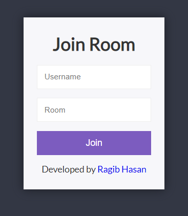
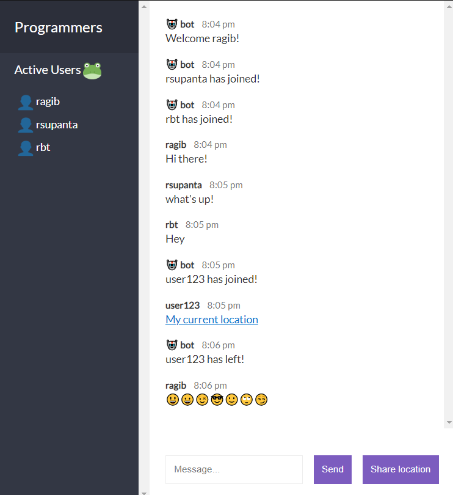

# Chat App

Simple Chat App with chatroom feature.<br/>
Just input username and room name to join.<br/>
Users can create room and join. Can send messages and share their current location.<br/>
Users can't send any bad words. All bad words are blocked!<br/>

<a href="https://rsupanta-chat.herokuapp.com/">Click here</a> to visit the App.<br/>

It was made using Node.js, Express.js and Socket.io<br/>
For frontend, I've used vanilla JS and Mustache template.<br/>
The UI was designed with CSS.<br/>

## Screenshots

### App Login



### Chat Room



## Requirements

```
Node.js 12+
npm 6+
```

## Installation

If you want to test my project or do whatever you want, here's a little guide:

### Cloning Repository

First clone this repository using git clone into your local machine:

```
$ git clone https://github.com/rsupanta/chat-app.git
```

Or you can download as zip file using github.

### Setting up Project Environment

Navigate into project directory.<br/>
Run command to install all dependencies:

```
$ npm install
```

The packages are going to install:

```
    "bad-words": "^3.0.3",
    "express": "^4.17.1",
    "socket.io": "^2.3.0"
```

### The Final Step

Navigate into project directory and run command-<br/>

```
$ npm run start
```

It will show server running status.<br/>

You can access the app by visiting

```
http://localhost:3000/
```

### Thanks for your time.
